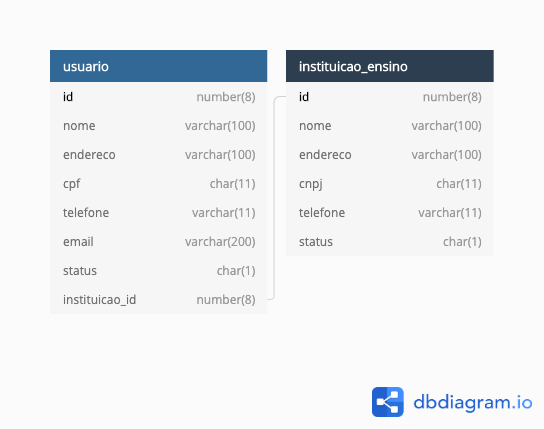

# Projeto Livraria

Este projeto foi criado com o intuito de participar de um teste para a eWave.

> ***Orlando Burli Júnior***  
> https://medium.com/@orlando.burli/  
> https://github.com/orlandoburli  
> https://www.linkedin.com/in/orlando-burli-junior

## Arquitetura

### Versão Java

Foi utilizado o OpenJ9 (JDK 11) para o desenvolvimento deste teste.

### Frameworks

Foi utilizado como base do projeto o Spring Boot 2.2.6. Algumas bibliotecas adicionais, da própria suite do spring:
  * **spring-boot-starter-data-jpa** - Core do Spring Boot para uso de JPA nos projetos
  * **spring-boot-starter-web** - Core do Spring Boot para API's 
  * **spring-boot-devtools** - Utilitários do Spring Boot para desenvolvedores
  * **org.postgresql** - Driver para postgres
  * **hibernate-validator** - Biblioteca adicional do Hibernate para adicionar os validadores JPA do Hibernate
  * **lombok** - Biblioteca utilitária para geração automática de getter's, setter's, builder's, entre outros.
  * **org.apache.commons (commons-lang3)** - Biblioteca da Apache, com diversas classes utilitárias
  * **commons-io** - Biblioteca utilitária para trabalhar com arquivos
  * **commons-codec** - Complementar ao *commons-io*, adicionar encoder's gerais.
  * **org.flywaydb** - Ferramenta para realizar *migrations* em bancos de dados, mantém os bancos atualizados em produção.
  * **spring-boot-starter-amqp** - Biblioteca para consumo de filas do RabbitMQ, usando protocolo AMQP.
  * **spring-boot-starter-mail** - Biblioteca de envio de emails.

Bibliotecas de teste:
  * **spring-boot-starter-test** - Core do Spring Boot para testes em microserviços.
  * **org.hamcrest** - Extensões das bibliotecas de Matcher's do JUnit (Já está embutido no spring-boot-starter-test)
  * **h2** - Driver do banco H2, utilizado para os testes unitários.
  * **javafaker** - Biblioteca utilitária para geração de dados aleatórios para testes.
  * **sonar-jacoco-listeners** - Dependência do sonar para poder gerar análises de código.

### Definição de pacotes
* br
  * com
    * orlandoburli
      * livraria
        * config - Classes de configuração da aplicação
        * constraints - Classes de validadores JPA customizados
        * converters - Conversores entre Dto's vs entidades, e também enum's vs atributos de banco.
        * dto - Todos os DTO's (Data Transfer Object's) da aplicação. São os objetos que são efetivamente expostos nos resources.
        * enums - Enum's utilizados nas entidades.
        * exceptions - Todas as exceptions de regras de negócio do sistema
        * handlers - "*Interceptadores*" do sistema, a exemplo do *GlobalExceptionHandler* que intercepta todos os erros e dá saída customizada nos serviços.
        * model - Entidades JPA do sistema.
        * repository - Todas as classes de acesso a dados do sistema. Aqui foi usada a interface *JpaRepository*.
        * resources - Endpoints do projeto. Expõe os métodos públicos dos services como resources.
        * service - Classes de regra de negócio. 
        * utils - Bibliotecas utilitárias.

### Processamento assíncrono

Na classe *NotificacaoService*, temos uma parte de processamento assíncrona. Como o envio de emails pode demorar, esta classe apenas cria a mensagem que deseja enviar, e usa o *RabbitTemplate* para enviar uma mensagem ao RabbitMQ server, na fila *livraria.notificacoes.queue*. 

Por sua vez, temos o *receiver* desta mensagem, que é a classe *MailSenderService*, que faz efetivamente o envio do email. Como não há métodos de try/catch, caso ocorra algum erro no envio da mensagem, esta será retentada até que dê certo, de forma que não perderemos nenhuma mensagem da fila.

### Conteinerização

Foi configurado também para este projeto, um Dockerfile simples, que consiste em pegar o jar gerado pelo projeto, que já é auto-executável, e embutir em uma imagem docker junto do openjdk 11. As imagens compiladas estão disponíveis em: https://hub.docker.com/repository/docker/oburlijr/livraria

Para o ambiente de desenvolvimento, também está disponível um arquivo docker-compose, na pasta infra, que levanta os serviços de banco de dados, do rabbitmq e do pgadmin web para acessar o banco de dados.

A parte de kubernetes não foi possível de realizar neste projeto, porém indico a leitura do meu artigo, sobre configuração de kubernetes com terraforms na aws.

https://medium.com/@orlando.burli/criando-e-gerenciando-um-cluster-kubernetes-stage-e-produ%C3%A7%C3%A3o-na-aws-com-terraform-5109e4b15ed7

### Swagger

Para acessar o swagger do projeto, basta executar o projeto e acessar a url: http://localhost:8080/swagger-ui.html. O mesmo é dinâmico, gerado pelas anotações presentes nas classes de *Resources*.

## Modelo de dados

Uma observação interessante sobre esta modelagem: é comum armazenar *blob's* diretamente na classe da entidade. Porém eu utilizo esta abordagem, de separar quaisquer dados binários em outra tabela, de forma a ter ganhos de performance tanto em leitura quanto em escrita, pois o banco de dados trabalha com leitura sequencial dos dados. Uma coluna binária poderia arruinar esta performance. Embora os bancos de dados mais modernos já tenham maneiras de contornar este problema (como o *Oracle* por exemplo, é possível colocar uma coluna específica em outra *tablespace*), é preferível esta abordagem que nos deixa livres para aproveitar outros recursos do banco (como o *table partitioning*, da *Oracle*).

## CI/CD

Foi configurado o CircleCI para build automatizada deste projeto, sendo seus artefatos armazenados na própria ferramenta.

https://app.circleci.com/pipelines/github/orlandoburli/ewave-livraria-arquiteto-java

## Testes automatizados

Neste projeto, escrevemos os testes em dois níveis: *Service* e *Resource*. 

Em *Service*, testamos unitariamente cada um dos serviços em detalhes de suas regras de negócio, incluindo as validações JPA, bem como seus retornos de mensagem.

Já em *Resource*, testamos as API's REST e suas fronteiras, testando o dado que entra, o dado que sai, e seus respectivos códigos HTTP. Fechando, desta maneira, todo o ciclo de API's.

Foi atingido o percentual de cobertura de . 

## Code Quality / Code Coverage

Neste projeto, configuramos o SonarCloud, que é o SonarQube na nuvem, que está gratuito para projetos open source. Podemos ver o resultado da qualidade do código no link abaixo.

https://sonarcloud.io/dashboard?id=orlandoburli_ewave-livraria-arquiteto-java

Foi atingida a nota  de qualidade de código, eliminando todos os possíveis bug's analisados pelo sonarqube, bem como os possíveis *code smells* detectados.

